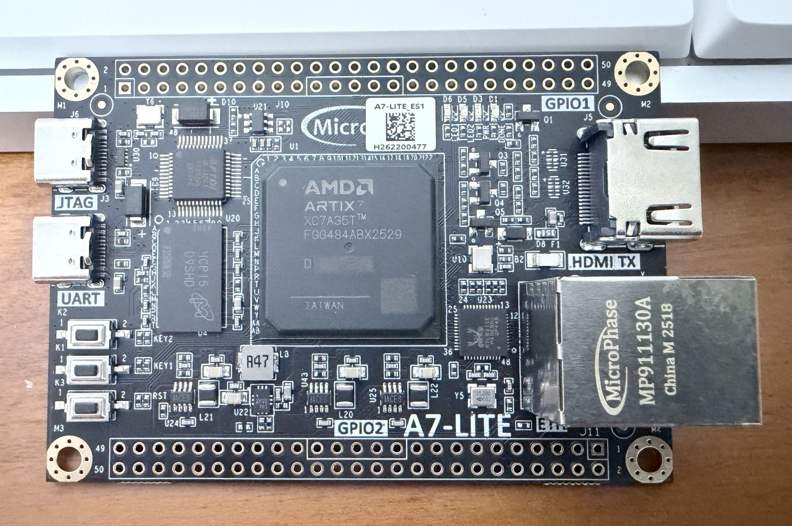
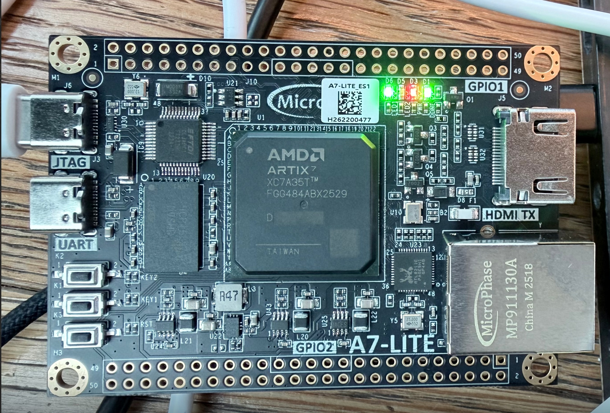

# Low-Latency FPGA UDP Feed Handler

This project develops a cut-through SystemVerilog receive pipeline for Ethernet II, IPv4 and UDP traffic. The design accepts an 8-bit packet stream, filters traffic by destination, decodes a compact market-data message and checks message sequence continuity.

The main design target is predictable packet-processing latency while sustaining one input byte per clock at 125 MHz.

## Measured results

The checked-in A7-LITE implementation meets its 8 ns clock constraint on an Artix-7 XC7A35T (`xc7a35tfgg484-2`).

| Result | Value |
| --- | ---: |
| Core clock | 125 MHz |
| Sustained input rate | 1 byte per clock |
| Payload cut-through latency | 1 cycle / 8 ns |
| Final message byte to decoded result | 1 cycle / 8 ns |
| 58-byte frame start to decoded result | 58 cycles / 464 ns |
| Post-route setup slack | +0.591 ns |
| Post-route hold slack | +0.216 ns |
| Slice LUTs | 601 / 20,800 (2.89%) |
| Slice registers | 588 / 41,600 (1.41%) |

Full timing and utilisation evidence is recorded in the [A7-LITE implementation results](docs/implementation_results.md).

## Design overview

The receive path is organised around the order in which fields arrive on the wire:

```text
Byte stream -> Ethernet -> IPv4 -> UDP -> destination filter
                                              |
                                              +-> payload output
                                              +-> message decoder -> sequence checker
```

Header fields are captured as soon as their final byte arrives. This avoids buffering a complete packet before processing begins and keeps the latency tied to fixed byte positions.

The design uses one clock domain and a ready/valid interface throughout. Input state advances only after a completed handshake, and output data is held stable while backpressured.

## Packet format

The supported receive format is intentionally focused:

- Ethernet II frames without VLAN tags
- IPv4 with a 20-byte header and no fragmentation
- UDP with one fixed-format message in the payload
- big-endian network byte order
- configurable destination MAC address, IPv4 address and UDP port
- input-valid gaps, back-to-back packets and output backpressure

The testbench starts at the first destination-MAC byte and provides `s_last` with the final packet byte. Ethernet preamble, frame check sequence and PHY signalling sit outside the receive pipeline.

## Message format

Each UDP payload contains one 16-byte project-specific message:

| Payload bytes | Field | Width |
| --- | --- | --- |
| 0 | Protocol version | 8 bits |
| 1 | Message type | 8 bits |
| 2-5 | Sequence number | 32 bits |
| 6-7 | Instrument ID | 16 bits |
| 8-11 | Price | 32 bits |
| 12-15 | Quantity | 32 bits |

Protocol version `0x01` defines Add Order (`0x01`), Cancel Order (`0x02`), Trade (`0x03`) and System Event (`0x04`) messages. The format is purpose-built for this design and does not reproduce a commercial exchange protocol.

## Sequence checking

Accepted messages establish and update the expected sequence number. The checker distinguishes normal progression, forward gaps, duplicates and out-of-order messages. Rejected or malformed packets do not affect sequence state.

## Hardware target



The board-specific image targets a MicroPhase A7-LITE ES1. Its 50 MHz oscillator feeds an MMCM that generates the 125 MHz processing clock. A deterministic packet replay exercises the complete receive pipeline after configuration, with the two user LEDs reserved for pass and fail results.

The board wrapper validates the packet-processing core and its implemented clock path. The RTL8211E PHY and Ethernet MAC remain outside the core boundary described below.

### Physical validation



The implemented image was programmed into the board's XC7A35T through the on-board JTAG interface. Vivado reported a successful FPGA startup, and the self-test completed with the pass LED asserted and the fail LED clear. Releasing the board reset reran the test and returned the same result.

## Verification and implementation

AMD Vivado and Vivado XSim 2026.1 are the reference tools. Verification is built around:

- directed SystemVerilog tests for fast RTL bring-up
- UVM 1.2 sequences, monitors, reference modelling and scoreboard checks
- assertions for ready/valid and packet-processing rules
- functional coverage for packet types, rejection reasons and sequence events
- cycle-based latency and throughput measurements

Synthesis, place-and-route and bitstream generation target the board's Artix-7 `xc7a35tfgg484-2`. The implemented design uses the 50 MHz board clock to produce a constrained 125 MHz core clock.

### Simulation evidence

Vivado XSim 2026.1 is the reference simulator. Checked-in Tcl captures the source files and simulation-top selection, while generated project and simulator data remain outside version control. The [XSim verification record](docs/xsim_verification.md) reports the executed tests, assertion scope and UVM scoreboard results.

## Repository structure

| Path | Purpose |
| --- | --- |
| `rtl/` | Synthesizable SystemVerilog |
| `tb/basic/` | Directed RTL tests |
| `tb/uvm/` | UVM verification environment |
| `assertions/` | Interface and design properties |
| `constraints/` | A7-LITE pin and timing constraints |
| `scripts/` | Vivado build, regression and programming automation |
| `docs/` | Design, protocol and verification notes |
| `reports/` | Selected simulation and implementation results |
| `waveforms/` | Waveform configurations and review evidence |

## Implemented capabilities

- cut-through Ethernet II, fixed-header IPv4 and UDP parsing
- configurable destination MAC, IPv4 address and UDP port filtering
- backpressure-safe UDP payload forwarding
- fixed-format market-message decoding
- sequence progression, gap, duplicate and out-of-order classification
- event-driven packet, rejection, message and sequence statistics

## Verification

The final A7-LITE Vivado project passes a 12-run XSim regression: nine directed tests, the deterministic UVM smoke test and two reproducible constrained-random seeds. The directed set covers individual blocks, an integrated four-packet scenario, cycle-accurate latency and the board validation image. Bound protocol assertions continuously check stream stability, event consistency and sequence classification during simulation. The implemented self-test was also programmed and exercised on the physical XC7A35T board.

The UVM 1.2 environment uses a conventional input agent containing a named sequencer, handshake-aware driver and passive input monitor. The output monitor, independent reference scoreboard and functional coverage remain directly under the environment. A deterministic smoke scenario exercises all supported message types, while a 40-packet constrained-random regression varies message fields, destination outcomes, sequence classifications, input gaps and output backpressure.

See [the design specification](docs/project_specification.md), [architecture notes](docs/architecture.md), [implementation results](docs/implementation_results.md), [directed-verification notes](docs/directed_verification.md), [UVM verification notes](docs/uvm_verification.md), [protocol-assertion notes](docs/assertions.md), [Ethernet parser notes](docs/ethernet_parser.md), [IPv4 parser notes](docs/ipv4_parser.md), [UDP/filter notes](docs/udp_filter.md), [message-decoder notes](docs/market_message_decoder.md), [sequence-checker notes](docs/sequence_checker.md), [statistics notes](docs/statistics.md) and [protocol reference](docs/protocol.md) for detailed design information.
