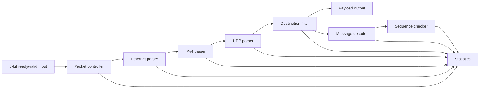

# Receive-Path Architecture

## Data path

Each block has a narrow responsibility. The parsers recover protocol fields, the filter decides whether the packet belongs to the configured feed, and the decoder interprets the accepted payload. The sequence checker consumes only `message_valid` events, after a complete message has passed all validation checks.

Statistics are updated from the same packet-end, rejection, message and sequence pulses exposed by the functional blocks. Counter logic therefore remains outside the parsing and decoding state machines.

## Cut-through processing

The controller maintains a packet-relative byte index that advances on `s_valid && s_ready`. Destination MAC is available after byte 5, source MAC after byte 11 and EtherType after byte 13. If EtherType identifies IPv4, IP parsing begins with byte 14 while the remainder of the frame is still arriving. The destination IP completes at byte 33 and the UDP destination port completes at byte 37. Header validation and the destination decision complete before payload byte 42.

The receive path stores individual fields rather than a full packet. A one-byte output holding register provides the elasticity needed for payload backpressure. The message decoder observes the same accepted payload transfers, so stalls pause forwarding and decoding at the same byte boundary.

## Flow control

- Input state changes only after a completed handshake.
- The source holds `s_data` and `s_last` stable while stalled.
- Payload data remains stable while `m_payload_valid` is asserted and `m_payload_ready` is low.
- `s_last` closes the current packet and prevents state from carrying into the next frame.
- Backpressure must not drop, duplicate or reorder payload bytes.

## Fixed packet offsets

| Packet bytes | Field |
| --- | --- |
| 0-5 | Destination MAC |
| 6-11 | Source MAC |
| 12-13 | EtherType |
| 14-33 | IPv4 header |
| 30-33 | Destination IPv4 address |
| 34-41 | UDP header |
| 36-37 | UDP destination port |
| 42-57 | Message payload |
| 44-47 | Sequence number |

The fixed 20-byte IPv4 header places the UDP header at byte 34 and the payload at byte 42. Variable-length IPv4 headers are rejected so these positions remain deterministic.

## A7-LITE validation top

The board-specific top sits outside the reusable receive pipeline. It generates 125 MHz from the A7-LITE's 50 MHz oscillator, synchronizes reset, replays one known packet and checks the decoded fields and counters. Active-low user LEDs retain the final pass or fail result.

The validation top feeds the same byte-stream interface used by the directed and UVM environments. It does not bypass or replace any parser, filter, decoder, sequence or statistics block.
