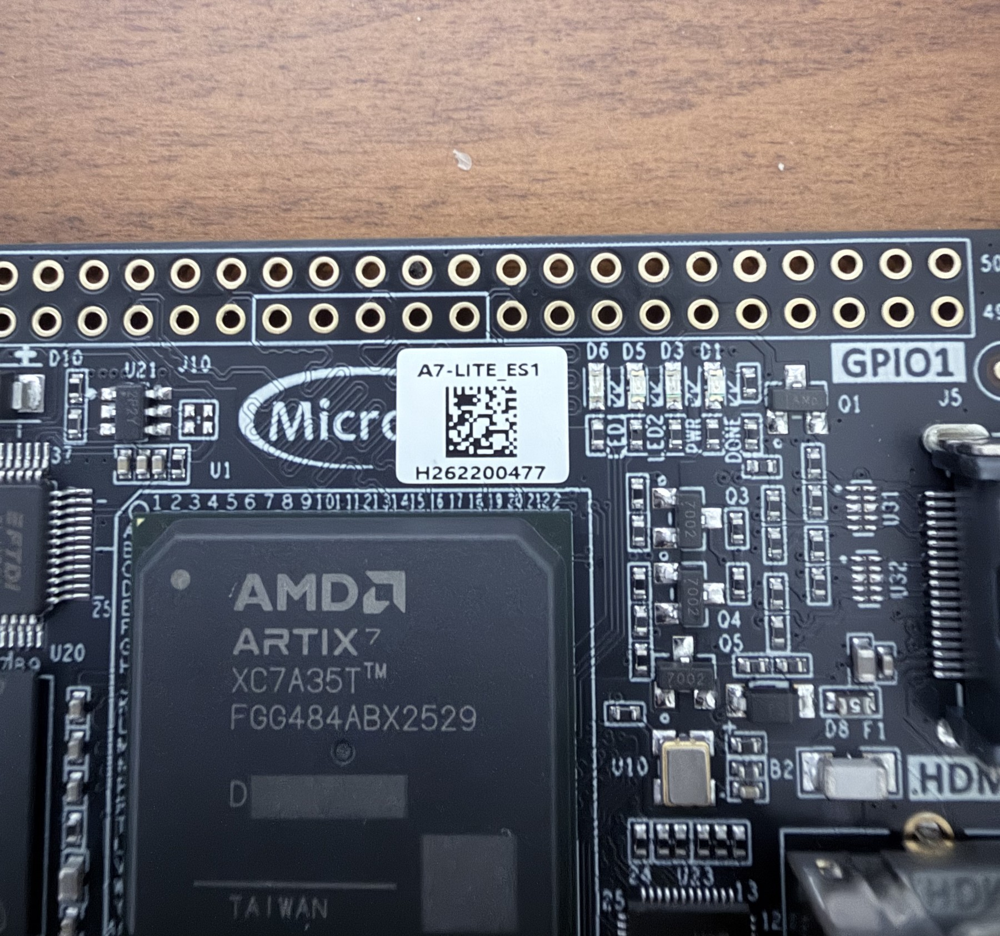
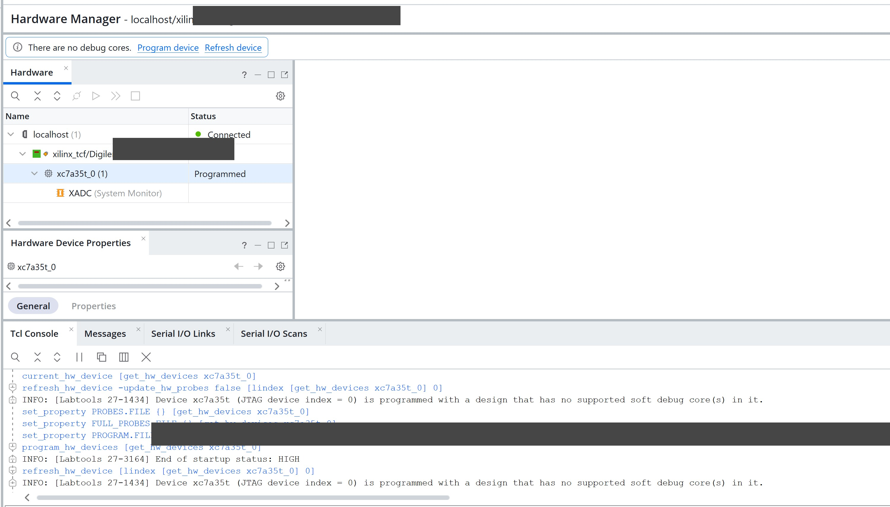

# A7-LITE Implementation Results

## Target

The board image targets a MicroPhase A7-LITE ES1 fitted with an AMD Artix-7 XC7A35T in the FGG484 package. Vivado uses part `xc7a35tfgg484-2`, matching the board specification and MicroPhase schematic.



The board's 50 MHz oscillator drives an MMCM configured for a 125 MHz output. Reset remains asserted until the MMCM locks and is then released through a four-stage synchronizer.

## Implemented result

Vivado 2026.1 completed synthesis, placement, routing, DRC and bitstream generation without warnings or errors.

| Timing result | Value |
| --- | ---: |
| Clock period | 8.000 ns |
| Clock frequency | 125.000 MHz |
| Worst setup slack | +0.591 ns |
| Total setup slack | 0.000 ns |
| Worst hold slack | +0.216 ns |
| Total hold slack | 0.000 ns |
| Failing setup/hold endpoints | 0 / 0 |

| Resource | Used | Available | Utilisation |
| --- | ---: | ---: | ---: |
| Slice LUTs | 601 | 20,800 | 2.89% |
| Slice registers | 588 | 41,600 | 1.41% |
| Block RAM tiles | 0 | 50 | 0.00% |
| DSPs | 0 | 90 | 0.00% |
| BUFGCTRL | 2 | 32 | 6.25% |
| MMCM | 1 | 5 | 20.00% |

The routed design has no failed or partially routed nets, and the implementation methodology report contains zero checks. The detailed Vivado outputs are retained as the [timing report](../reports/a7_lite/post_implementation_timing.rpt), [utilisation report](../reports/a7_lite/post_implementation_utilization.rpt), [methodology report](../reports/a7_lite/post_implementation_methodology.rpt) and [clock report](../reports/a7_lite/clock_utilization.rpt). Machine-specific paths and host names are removed from their headers.

Download the generated [A7-LITE programming image](../reports/a7_lite/a7_lite_self_test.bit).

<details>
<summary>Verify the download (SHA-256 checksum)</summary>

SHA-256 produces a fingerprint of a file, displayed as 64 hexadecimal characters. Compare the downloaded image's checksum with the value below to confirm that it matches the image used for this implementation.

```text
B6C2AD24750F75E49E78851D20AE84268C0FF882E1C1871538A8A42CCD54E3F2
```

In PowerShell, run this command from the folder containing the downloaded image:

```powershell
Get-FileHash .\a7_lite_self_test.bit -Algorithm SHA256
```

The `Hash` value should match the checksum above (letter case does not matter).

</details>

## Physical validation

The generated image was loaded into the A7-LITE through its on-board Digilent JTAG interface. Vivado detected the expected `xc7a35t_0` device, completed `program_hw_devices` and reported `End of startup status: HIGH`.



On the board, D6 (`LED1`, FPGA pin M18) latched the pass result while D5 (`LED2`, FPGA pin N18) remained clear. Pressing and releasing K3 reset the design; the packet replay completed again with the same stable pass indication.


This run confirms JTAG configuration, the 50 MHz board clock, MMCM-generated 125 MHz processing clock, reset release, packet replay, field decoding and final counter checks on the physical device. It does not exercise the RTL8211E Ethernet PHY or an RGMII MAC.

## Latency

Latency is measured with an unstalled 58-byte Ethernet/IPv4/UDP frame at 125 MHz.

| Measurement point | Cycles | Time |
| --- | ---: | ---: |
| First accepted payload byte to payload output | 1 | 8 ns |
| Final message byte to `message_valid` | 1 | 8 ns |
| First frame byte to `message_valid` | 58 | 464 ns |

The first two figures describe the processing latency once the required byte is present. The frame-start figure also includes the serial arrival time of the remaining bytes on the 8-bit interface.

## On-board self-test

`a7_lite_self_test_top` replays one known Add Order packet through `udp_feed_handler_top`. It checks every decoded field and the final packet, message and sequence counters. LED1 latches the pass result; LED2 latches a rejection, data mismatch or timeout.

This image validates the implemented core, board clock generation, reset path and LED outputs. It does not claim live Ethernet reception: RGMII conversion, preamble handling and FCS checking remain MAC-layer responsibilities outside `udp_feed_handler_top`.
