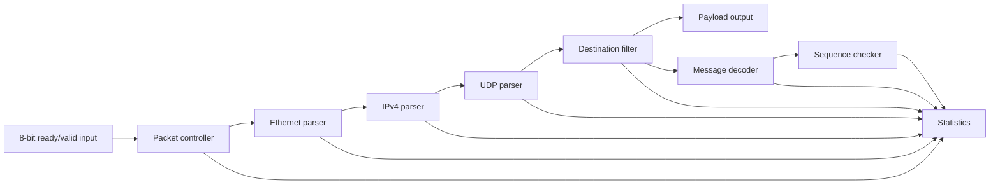

# Receive-Path Architecture

## Data path

Each block has a narrow responsibility. The parsers recover protocol fields, the filter decides whether the packet belongs to the configured feed, and the decoder interprets the accepted payload. Sequence checking occurs only after a complete message has passed all validation checks.

## Cut-through processing

The controller maintains a packet-relative byte index that advances on `s_valid && s_ready`. Destination MAC is available after byte 5, source MAC after byte 11 and EtherType after byte 13. If EtherType identifies IPv4, IP parsing begins with byte 14 while the remainder of the frame is still arriving.

The receive path stores individual fields rather than a full packet. A small output holding register provides the elasticity needed for payload backpressure.

## Flow control

- Input state changes only after a completed handshake.
- The source holds `s_data` and `s_last` stable while stalled.
- Payload data remains stable while `m_payload_valid` is asserted and `m_payload_ready` is low.
- `s_last` closes the current packet and prevents state from carrying into the next frame.
- Backpressure must not drop, duplicate or reorder payload bytes.

## Fixed packet offsets

| Packet bytes | Field |
| --- | --- |
| 0-5 | Destination MAC |
| 6-11 | Source MAC |
| 12-13 | EtherType |
| 14-33 | IPv4 header |
| 30-33 | Destination IPv4 address |
| 34-41 | UDP header |
| 36-37 | UDP destination port |
| 42-57 | Message payload |
| 44-47 | Sequence number |

The fixed 20-byte IPv4 header places the UDP header at byte 34 and the payload at byte 42. Variable-length IPv4 headers are rejected so these positions remain deterministic.
